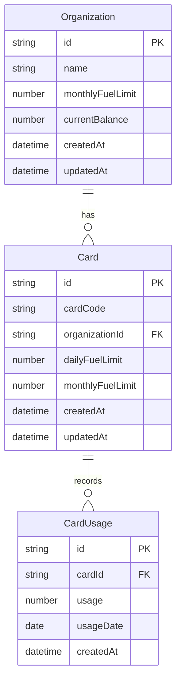
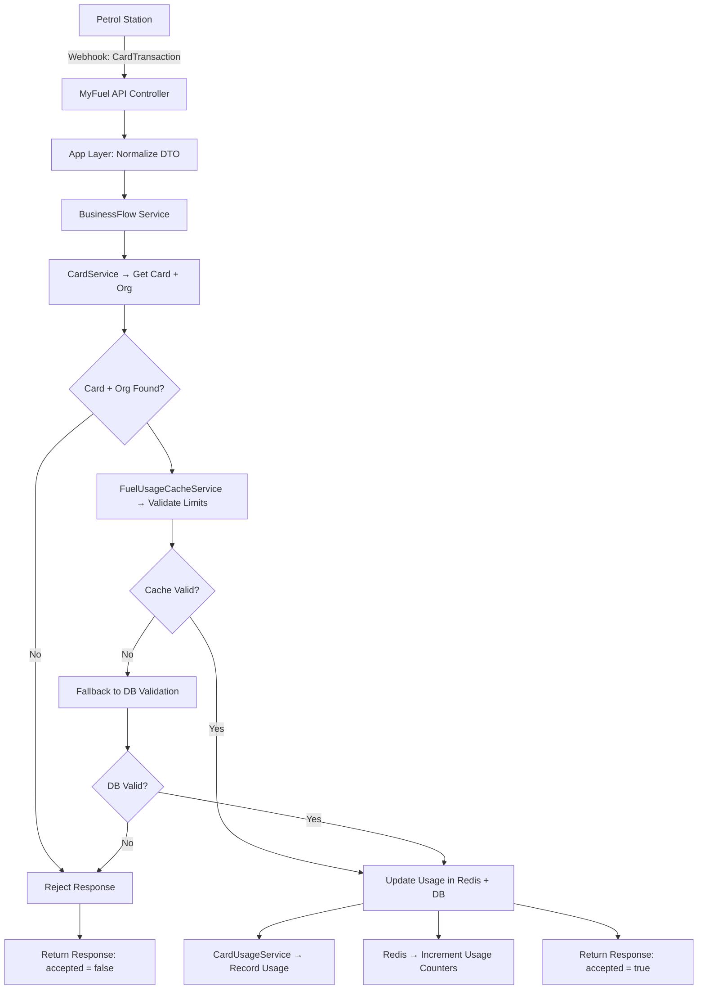

# My Fuel

MyFuel is a core service within the MyLorry fleet management platform. It handles fuel transactions initiated at petrol stations, validates them against organizational and card-level limits, and records usage in both Redis and the database.

## Design Philosophy: Ledger vs. Balance

In designing the fuel transaction system, I faced a foundational decision: Should the organization’s fuel balance be modeled as a mutable field, or as an accumulated ledger of usage?

I chose the ledger-based approach for several reasons:

- Auditability: Every transaction is recorded as an immutable usage entry, allowing full traceability.
- Concurrency Safety: No race conditions or locking issues around a shared balance field.
- Alignment with Domain: Fuel usage is inherently transactional and time-bound — a ledger reflects this naturally.
- Scalability: Redis mirrors usage counters for fast validation, while the database remains the source of truth.

While the business spec uses the verb “deduct”, this system models deduction through accumulation and validation. Limits are enforced by comparing the sum of usage records against static thresholds — not by mutating a balance field.

This design ensures correctness, resilience, and future extensibility (e.g. weekly limits, vehicle-based constraints) without compromising performance.

## System Overview
- Accepts webhook transactions from petrol stations.
- Identifies the card and its associated organization.
- Validates against:
  - Organization’s monthly fuel limit
  - Card’s daily and monthly limits
- Records usage in Redis and Postgres.
- Returns structured response with accepted: true | false.


## ERD


## Validation Logic

- Cache-first via Redis
- Fallback to DB if cache is missing
- Limits checked:
  - Organization monthly
  - Card monthly
  - Card daily

# Assumptions

- Organization balance is modeled via usage accumulation.
- Redis is used for performance, not as source of truth.
- Card codes are unique and used for lookup.
- Transactions are atomic and idempotent per card/date.

## Flow Diagram



## Tech Stack

- NestJS (TypeScript)
- TypeORM (Postgres)
- Redis (via @nestjs/cache-manager)
- class-validator / class-transformer
- Swagger (OpenAPI)
- GitHub Actions (CI/CD)

## Setup Instructions

clone the repo and:

```bash
	cd my-fule
	yarn install
```

### Environment Configuration

To run the service locally, create a `.env` file in the root directory. You can use the provided `.env_template` as a starting point:

```bash
# SERVICE_NAME: Used for Redis key prefixing, Swagger page title, and PG connection appName
SERVICE_NAME=my_fuel

# HTTP Server Configuration
CORE_HTTP_PORT=3000
CORE_HTTP_HOSTNAME=localhost

# Environment Mode
ENV_MODE=dev

# PostgreSQL Configuration
DB_POSTGRES_HOST=localhost
DB_POSTGRES_PORT=5432
DB_POSTGRES_USER=your_db_user
DB_POSTGRES_PASSWORD=your_db_password
DB_POSTGRES_DATABASE=myfuel_db
DB_POSTGRES_SYNCHRONIZE=true # Set to false in production

# Redis Configuration
DB_REDIS_HOST=localhost
DB_REDIS_PORT=6379
DB_REDIS_PASSWORD=your_redis_password # Optional
DB_REDIS_DB=0 # Optional
```

NOTE: Keep i mind, `DB_POSTGRES_SYNCHRONIZE` must bet set to false in production.

### Run it

```bash
yarn start:dev
```

## Testing

```bash
npm run test
```


## API Documentation
Swagger is available at http://[CORE_HTTP_HOSTNAME]:[CORE_HTTP_PORT]/api
